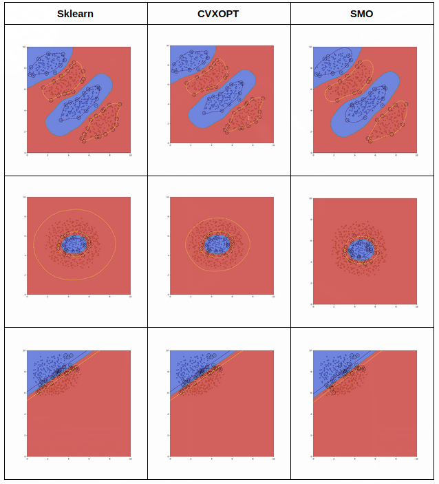

# Support Vector Machine from scratch

Build SVM from scratch using only Python and some helper libraries: pandas, numpy,..

There are 5 tasks in total:

- **Task 1**: Inference.
- **Task 2**: Kernelize SVM.
- **Task 3**: Training using convex optimization library.
- **Task 4**: Training using self-implementeed library.
- **Task 5**: Visualization + Comparison with sklearn.

# Installation guide 🔥

```
$ git clone https://github.com/trungdt21/svm-from-scratch
$ cd svm-from-scratch

# if you use pip
$ pip install -r requirements.txt
# if you use conda
$ conda create -n svm --file package-list.txt

$ pip install -e .
$ pre-commit install
```

## Currently used hooks:

- `isort`: Sort imports.
- `black`: General python formatter.
- `flake8`: Check PEP8 convention.
- `pre-commit`: Run those hooks before commits.

# Work Convention ✨

- Code convention: Follow PEP8 convention (include docstrings for functions).
- Update `__init__.py` when you add new modules.
- Use pre-commit so that the code would not be messy when merge between commits:
  - Usually, you can just `git commit` and `pre-commit` will run itself.
  - If you want to run it manually, use `pre-commit run --all-files` to run all files, `pre-commit run <hook_id>` to run a specific hook.
- Remember to put understandable commit descriptions.
- Update `taskX.md` of your task (documentation, progress, API documentation) usually so that other can follow it.
- Write tests if you can.

# API

## Install

```
  # Install the package
  pip install -e .
```

## Usage

```
from svm import SVM_SMO, SVM_cvxopt

# We support 4 kernels: linear, sigmoid, poly, rbf.
model = SVM_SMO(C=100, kernel="linear", degree=3.0, gamma=1.0, coef=0.0)
or
model = SVM_cvxopt(C=100, kernel="linear", degree=3.0, gamma=1.0, coef=0.0)

model.fit(X,Y)
model.predict(Xtest)

```

# Result



# Contributors 🥺

- Phan Hoang Viet
- Tran Duc Nam
- Nguyen Hien Tuan Duy
- Dao Tuan Trung
- Mentor: Dzung Nguyen
